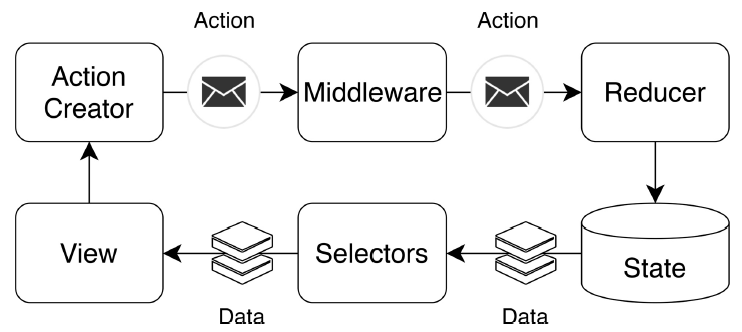
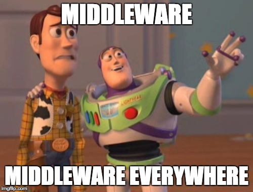

# Redux demo

Introduction to redux and redux-saga

## Resources

### Redux

Just some recommended videos, courses and documentation about Redux

- [Dan Abramov - Live React: Hot Reloading with Time Travel at react-europe 2015](https://www.youtube.com/watch?v=xsSnOQynTHs)

- [Building React Applications with Idiomatic Redux](https://egghead.io/courses/building-react-applications-with-idiomatic-redux)

- [Redux Style Guide](https://redux.js.org/style-guide/style-guide)

- [Redux Toolkit](https://redux-starter-kit.js.org/)

- [Boris Dinkevich: Practical Advanced Redux — ReactNext 2017](https://www.youtube.com/watch?v=Gjiu7Lgdg3s)

- [Advanced Redux Patterns - Nir Kaufman @ ReactNYC](https://www.youtube.com/watch?v=JUuic7mEs-s)

### Redux-Saga

The same about Redux-Saga.

- [Redux-Saga](https://redux-saga.js.org/)

- [Learn Redux Saga](https://www.youtube.com/playlist?list=PLMV09mSPNaQlWvqEwF6TfHM-CVM6lXv39)

- [The best way to test Redux Sagas](https://dev.to/phil/the-best-way-to-test-redux-sagas-4hib)

## Further exploration when you're bored

### Reactive programming with RxJS and redux-observable

Programming by manipulating streams of actions.

- [The introduction to Reactive Programming you've been missing](https://gist.github.com/staltz/868e7e9bc2a7b8c1f754)

- [Introduction to Redux-Observable](https://www.youtube.com/watch?v=zk2bVBZhmcc)

- [redux-observable](https://redux-observable.js.org/)
